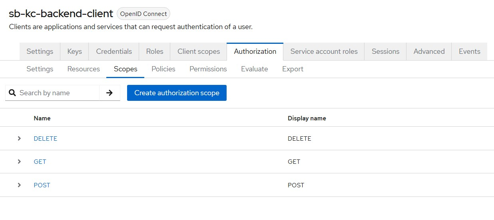
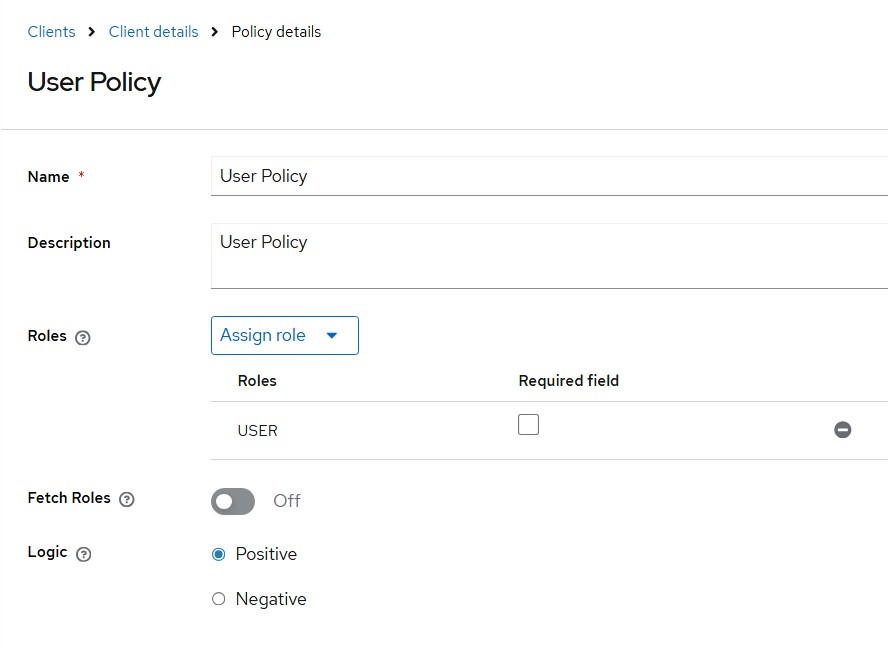
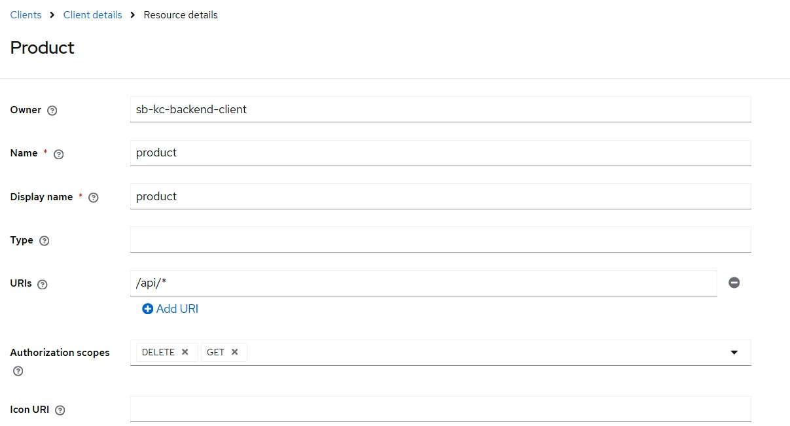
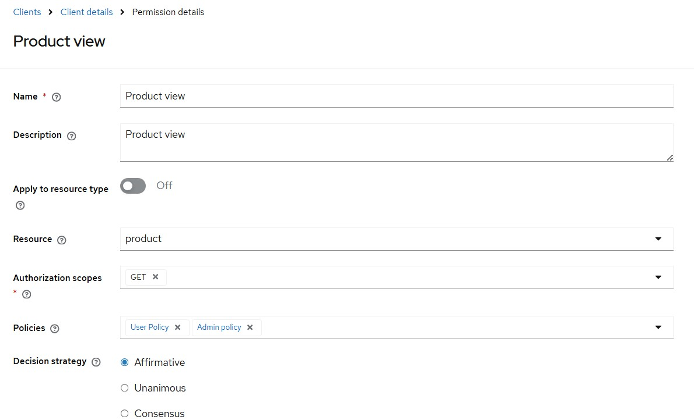

# Spring Boot + Keycloak Fine-Grained Authorization

This project demonstrates a lightweight approach for implementing fine-grained authorization in Spring Boot using:

- Spring Security OAuth2 Resource Server
- Keycloak Authorization Services
- Redis-based authorization caching

Instead of relying on adapter-based policy enforcement, the project uses a custom authorization filter integrated directly with Spring Security.

---

## Key Features

- Fine-grained authorization using Keycloak Authorization Services
- Resource and scope-based access control
- Stateless JWT authentication with Spring Security
- Redis-based authorization decision caching
- Policy version-based cache invalidation
- Lightweight custom authorization filter
- Dynamic resource loading from Keycloak

---

## Why Not Just Use `@PreAuthorize`?

Spring Security annotations such as:

```java
@PreAuthorize("hasRole('ADMIN')")
```

work well for simple role-based access control.

However, in larger systems authorization rules often become:
- dynamic
- resource-specific
- centrally managed
- difficult to maintain across multiple microservices

Examples:
- User can `GET` a resource but not `DELETE`
- Different APIs require different permissions
- Permissions change frequently without application redeployment

Instead of hardcoding authorization rules directly inside application code, this project demonstrate how to delegate authorization decisions to Keycloak Authorization Services.

Benefits:
- centralized authorization management
- dynamic permission updates
- fine-grained resource and scope-based access control
- reduced authorization logic inside microservices


## Architecture

```text
Client
   |
   v
Spring Security JWT Validation
   |
   v
Custom Authorization Filter
   |
   +----> Redis Cache
   |
   +----> Keycloak Authorization Services
   |
   v
Protected API
```

---

## How this Works

1. Client sends a JWT access token.
2. Spring Security validates the JWT locally.
3. `KeycloakAuthFilter` intercepts the request.
4. Request URI is mapped to a Keycloak Resource.
5. HTTP method is mapped to a scope (`GET`, `POST`, `DELETE`, etc.).
6. Redis cache is checked using:
    - username
    - resource
    - scope
    - policy version
7. If no cached decision exists:
    - the application sends a permission evaluation request to Keycloak using:
```text
grant_type=urn:ietf:params:oauth:grant-type:uma-ticket
```
8. Keycloak evaluates policies and returns an authorization decision.
9. The decision is cached in Redis for 5 minutes.
10. Request is allowed or rejected.

---

# Authorization Cache Strategy

Authorization decisions are cached in Redis to reduce:
- repeated calls to Keycloak
- authorization latency
- load on the authorization server

Cache key format:

```text
username:resource:scope:policyVersion
```

When policies are updated:
- policy version is incremented
- old cached entries become logically invalid

---

## Prerequisites

- Java 17+
- Maven 3.8+
- Docker
- Docker Compose

---

## Getting Started

### 1. Start Infrastructure

```bash
docker compose -f docker/docker-compose.yaml up -d
```

Services:
- Keycloak → http://localhost:7080
- Redis → localhost:6379

Default Keycloak admin credentials:

```text
admin / admin
```

---

## 2. Configure Keycloak

The project expects:
- Realm: `sb-kc-realm`

### Clients: 

#### sb-kc-ui-client
This client will be used to call your Java API.
- Client authentication = OFF
- Authorization Enabled = OFF
- Authorization Code Flow

#### sb-kc-backend-client
This client will be used by your java app to interact wilt Keycloak Authorization services.
- Client authentication = ON
- Authorization Enabled = ON
- Client Credentials Grant Flow


Define following inside `sb-kc-backend-client`. Go to Authorization tab and create following: 
- Resources
- Scopes
- Policies
- Permissions

Example:
- Resource: `/api/products`
- Scopes: `GET`, `DELETE`
- Policy: `ADMIN ONLY`
- Permission: Resource + Scope + Policy mapping






---

## 3. Configure Application

Set client secret:

```bash
export SB_KC_BACKEND_CLIENT_SECRET=your-secret
```

Or update `application.yaml`.

---

## 4. Run Application

```bash
mvn spring-boot:run
```

---

## Example Endpoints

### Protected APIs

```text
GET    /api/products
DELETE /api/products/{id}
```

Authorization is evaluated dynamically by Keycloak Authorization Services.

---

### Internal Endpoints

```text
POST /internal/policy/refresh
```

Increments the policy version in Redis and forces re-evaluation of cached authorization decisions.

---

## Main Components

### `KeycloakAuthFilter`
Custom authorization filter placed after Spring Security JWT authentication.

Responsibilities:
- resource mapping
- scope mapping
- permission evaluation
- access enforcement

### `KeycloakPolicyEnforcer`
Performs permission evaluation against Keycloak Authorization Services using UMA permission requests.


### `ResourceCache`
Caches URI-to-resource mappings loaded from Keycloak during application startup.

### `KeycloakPolicyCacheService`
Handles Redis-based authorization decision caching.

---
# License

MIT